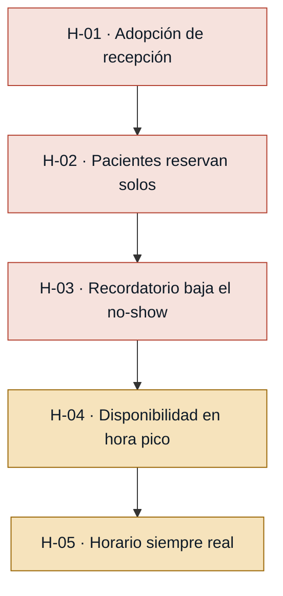
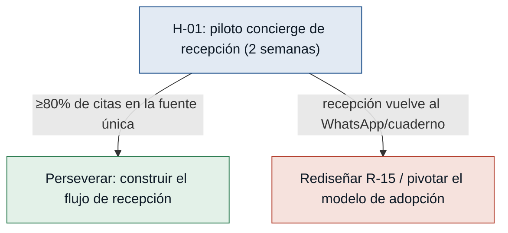

# Hipótesis y experimentos — citasdentista

> Generado desde: `mvp-canvas.md` (Riesgos / supuestos + métrica de éxito),
> `requisitos.md` y `evidence-map.json`.
> Idea rectora: el puente entre **output** e **impact** es una **hipótesis**, y las
> hipótesis se comprueban. Cada experimento es **comprar información barata** sobre
> el riesgo más grande antes de construir.
> Ordenadas de **mayor a menor riesgo**: primero se prueba lo que más puede tumbar el MVP.

---

## Mapa de riesgo

---

### [H-01] Adopción de recepción — riesgo: alto
- **Supuesto a probar:** recepción adoptará el sistema como fuente única en hora
  pico, en vez de volver al cuaderno/WhatsApp si lo siente lento o complejo
  (`riesgo-abandono-sistema`, R-15). Es el riesgo #1 del canvas: si recepción lo
  abandona, no hay fuente única y el resto del tablero es irrelevante.
- **Hipótesis:** Creemos que la secretaria gestionará las citas dentro de una sola
  agenda compartida si agendar o modificar una cita le cuesta menos esfuerzo que su
  flujo actual de WhatsApp+papel, porque su dolor principal es el desorden de
  múltiples canales sin fuente de verdad.
- **Señal medible:** % de citas de la semana registradas y gestionadas dentro de la
  fuente única vs. fuera de ella (WhatsApp/papel/llamada).
- **Criterio de éxito:** en la semana 2 del piloto, **≥80%** de las citas quedan en
  la fuente única y recepción no reabre el cuaderno en hora pico.
- **Experimento:** **Concierge/piloto** — durante 2 semanas recepción opera toda la
  agenda en hora pico sobre un prototipo (o agenda compartida configurada como
  fuente única); observamos su uso real y registramos qué se sale del sistema.
- **Caja de tiempo/costo:** 2 semanas, 1 clínica, sin construir el backend definitivo.
- **Regla de decisión:** Si pasa → construir el flujo de recepción tal cual. Si
  falla → el flujo es demasiado pesado para hora pico; rediseñar la operación de
  recepción (R-15) antes de construir; si tras rediseño sigue fallando, pivotar el
  modelo de adopción. No avanzar a más features.

### [H-02] Los pacientes reservan solos — riesgo: alto
- **Supuesto a probar:** los pacientes reservarán por sí mismos en el enlace en
  lugar de seguir escribiendo por WhatsApp o llamando.
- **Hipótesis:** Creemos que el paciente completará su reserva de forma autónoma si
  recibe un enlace simple operable desde el móvil (R-14) con horarios reales
  visibles, porque hoy reserva a ciegas y sin confirmación y eso le genera
  incertidumbre.
- **Señal medible:** % de pacientes contactados que completan la reserva por el
  enlace sin volver a escribir por WhatsApp ni llamar a recepción.
- **Criterio de éxito:** **≥40%** de los pacientes a los que se ofrece el enlace
  reservan por sí mismos en las 2 semanas de prueba.
- **Experimento:** **Fake door / Mago de Oz** — difundir un enlace de reserva real
  (formulario que captura datos y muestra horarios; detrás recepción confirma a
  mano) por los canales actuales; medir cuántos lo usan solos.
- **Caja de tiempo/costo:** 2 semanas, enlace + planilla manual detrás, sin sistema completo.
- **Regla de decisión:** Si pasa → mantener el autoservicio como núcleo. Si falla →
  el autoservicio no es deseable para este público; pivotar a que recepción agende
  y el sistema solo confirme/recuerde, en vez de descartar el MVP entero.

### [H-03] El recordatorio baja el no-show — riesgo: alto
- **Supuesto a probar:** el recordatorio automático realmente reduce el no-show, no
  solo informa. Es el supuesto causal del que cuelga la **métrica de éxito** del MVP.
- **Hipótesis:** Creemos que los pacientes que reciben confirmación + recordatorio
  asistirán más que los que no, si el recordatorio llega antes de la cita con
  fecha/hora/doctor, porque parte del no-show se explica por olvido (`olvido-cita`).
- **Señal medible:** tasa de no-show = citas en estado «no asistió» ÷ citas
  confirmadas, comparada entre grupo con recordatorio y grupo sin recordatorio.
- **Criterio de éxito:** la tasa de no-show del grupo con recordatorio es **≥30%
  menor** (en términos relativos) que la del grupo de control, en 3-4 semanas.
- **Experimento:** **A/B manual** — a la mitad de las citas del periodo se les envía
  recordatorio a mano (WhatsApp/SMS) y a la otra mitad no (línea base); se comparan
  las tasas de no-show.
- **Caja de tiempo/costo:** 3-4 semanas, envíos manuales, sin automatizar nada todavía.
- **Regla de decisión:** Si pasa → invertir en el recordatorio automático como motor
  del MVP. Si falla → el recordatorio no mueve la asistencia; descartar el
  recordatorio como palanca principal e investigar la causa real del no-show antes
  de construirlo.

### [H-04] Disponibilidad en hora pico — riesgo: medio
- **Supuesto a probar:** el sistema sostiene la operación de recepción en hora pico
  sin caídas (R-16); una caída devuelve todo al caos y mata la adopción.
- **Hipótesis:** Creemos que recepción podrá agendar y modificar citas en hora pico
  sin interrupciones si la solución responde de forma estable bajo carga concurrente,
  porque la disponibilidad continua es condición para que no vuelvan al cuaderno.
- **Señal medible:** % de operaciones de agendamiento/modificación completadas sin
  error ni caída durante las franjas de hora pico, y tiempo de respuesta por operación.
- **Criterio de éxito:** **≥99%** de las operaciones en hora pico se completan sin
  error y cada una resuelve en **≤3 segundos**, durante 1 semana de prueba de carga.
- **Experimento:** **Prototipo + prueba de carga** — simular la concurrencia de hora
  pico sobre el prototipo de recepción y medir errores y latencia.
- **Caja de tiempo/costo:** 1 semana de prueba de carga sobre prototipo.
- **Regla de decisión:** Si pasa → la arquitectura prevista es suficiente. Si falla →
  reforzar infraestructura y/o añadir un modo de respaldo offline antes de lanzar;
  no construir más funcionalidades encima hasta resolver la disponibilidad.

### [H-05] El horario mostrado es siempre real — riesgo: medio
- **Supuesto a probar:** los horarios mostrados al paciente reflejan la
  disponibilidad real en tiempo real (R-17); turnos desactualizados generan doble
  agendamiento y rompen la confianza.
- **Hipótesis:** Creemos que el paciente confiará y reservará si nunca ve un turno
  que ya está ocupado, si el sistema bloquea el turno al instante de reservarlo,
  porque hoy desconfía de la disponibilidad y reserva a ciegas
  (`desconfianza-disponibilidad`).
- **Señal medible:** número de conflictos por datos desactualizados (turnos
  mostrados como libres que ya estaban ocupados / dobles agendamientos) durante el piloto.
- **Criterio de éxito:** **0 dobles agendamientos** por datos desactualizados (o
  **<1%** de las reservas) en 2 semanas de piloto.
- **Experimento:** **Prototipo desechable** — piloto con reserva concurrente real
  (varios pacientes + recepción agendando a la vez) y conteo de conflictos sobre el
  mismo turno.
- **Caja de tiempo/costo:** 2 semanas, dentro del mismo piloto de H-01.
- **Regla de decisión:** Si pasa → la consistencia en tiempo real es suficiente para
  exponer la reserva pública. Si falla → resolver la consistencia (bloqueo de turno
  en tiempo real) antes de abrir la reserva al paciente; no exponer el enlace
  público hasta lograrlo.

---

## Árbol de decisión del experimento #1 (el más urgente)

---

> **Por qué estas métricas pasan la prueba ácida:** ninguna cuenta descargas,
> features lanzadas ni mensajes enviados. Cada una cambia una decisión de negocio:
> si recepción no adopta (H-01) o los pacientes no reservan solos (H-02), no se
> construye el núcleo; si el recordatorio no baja el no-show (H-03), se descarta como
> palanca; si no hay disponibilidad (H-04) o consistencia (H-05), no se expone al
> paciente hasta resolverlo.
