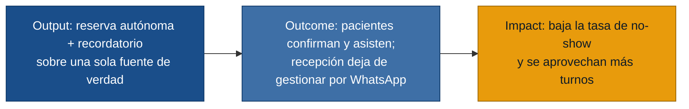

# MVP Canvas — citasdentista

> Generado desde: `personas.md`, `requisitos.md`, `user-stories.md`, `evidence-map.json`.
> El MVP ataca el **núcleo de valor** común a las tres personas, no la lista
> completa de deseos. Lo demás está explícito en *Fuera de alcance*.

---

## El núcleo, en una frase

Hoy las citas viven repartidas entre llamadas, WhatsApp, agenda de papel y
presencial, **sin una fuente de verdad**. De ahí salen los tres dolores que más
se repiten: doble agendamiento y desorden (secretaria), turnos perdidos por
no-shows (doctor y secretaria) y reservas a ciegas sin confirmación (paciente).
El MVP los ataca de raíz: **una sola fuente de verdad donde el paciente reserva
turnos reales por sí mismo, recibe confirmación y recordatorio automáticos, y
tanto recepción como el doctor ven el mismo estado al momento.**

---

## MVP Canvas — Sistema de reserva de citas para consulta dental

| Bloque | Contenido |
|---|---|
| **Propuesta de valor** | Reemplazar el caos de canales (llamada/WhatsApp/papel) por una única agenda en línea: el paciente reserva, confirma, cancela y reagenda turnos reales por sí mismo; recepción y doctor ven el mismo estado al momento. Menos errores, menos turnos perdidos, menos trabajo manual de recepción. |
| **Segmento de usuarios** | **Primario:** paciente (reserva autónoma) y secretaria (operación sin doble agendamiento, fuente única). **Beneficiario directo:** doctor (agenda predecible con contexto). Los tres con respaldo de primera mano (`personas.md`). |
| **Funcionalidades mínimas** | US-01 ver disponibilidad real · US-02 reserva autónoma con captura de datos · US-03 confirmación automática · US-04 recordatorio automático · US-05 cancelar/reagendar por enlace · US-06 anti doble-agendamiento · US-07 estado de cita como fuente única · US-08 agenda del doctor en tiempo real con contexto. |
| **Resultado esperado (outcome)** | Las citas dejan de gestionarse por WhatsApp/llamada/papel y pasan a gestionarse en el sistema; los pacientes que confirman y reciben recordatorio **asisten más** (menos no-shows) y recepción deja de recolectar y confirmar a mano. |
| **Métrica de éxito** | **Tasa de no-show** = citas en estado `no asistió` ÷ citas confirmadas del periodo. Meta del MVP: reducirla respecto a la línea base de la clínica. **Métrica guía de adopción:** % de citas creadas/gestionadas en el sistema vs. fuera de él (si es baja, recepción volvió al WhatsApp y nada más importa). |
| **Riesgos / supuestos** | (1) **Adopción de recepción** — el doctor teme que si es complejo, recepción vuelve al cuaderno/WhatsApp (`riesgo-abandono-sistema`); el MVP debe ser rápido en hora pico (R-15). (2) **Los pacientes sí reservan solos** en lugar de seguir escribiendo por WhatsApp. (3) **El recordatorio sí baja el no-show** y no solo informa. (4) **Disponibilidad del sistema en hora pico** (R-16): una caída devuelve todo al caos. (5) Que el horario mostrado sea siempre real (R-17) para no romper la confianza del paciente. |
| **Fuera de alcance (por ahora)** | Ver detalle abajo. |

---

## Output → Outcome → Impact (el puente)

---

## Fuera de alcance (por ahora) — y por qué

| Qué NO entra | Por qué se posterga |
|---|---|
| **Reportes operativos** (citas del día, confirmados/cancelados/no asistidos por doctor) — R-11 | Es información *sobre* la operación, no la operación. Solo tiene sentido cuando ya haya datos reales fluyendo por el sistema. Primero hay que lograr que la gente lo use. |
| **Estadísticas de horarios con más ausentismo** — R-12 | Optimización fina; depende de acumular historial. Adelantarla es pulir algo antes de validar el núcleo. |
| **Bloqueo de rangos de agenda por el doctor** (reuniones, emergencias) — R-08 | Útil, pero no es el núcleo de valor; en el MVP recepción puede no abrir esos turnos manualmente. Entra apenas el núcleo demuestre adopción (US-09). |
| **Integración multicanal automática** (que WhatsApp/llamada caigan solos al sistema) | El MVP consolida moviendo el flujo *hacia* el enlace de reserva, no automatizando los canales viejos. Mantener WhatsApp vivo en paralelo conspira contra la fuente única. |
| **Historia clínica / datos médicos del paciente** | El propio doctor lo descartó: *"no necesito que la agenda sea una historia clínica completa"* (`doctor.md`). El MVP da contexto de cita, no expediente. |
| **Pagos / cobros previos a la cita** | El paciente lo menciona como deseable, pero no es el dolor central y añade complejidad regulatoria y de integración. |

---

## Por qué la métrica pasa la prueba ácida

- **No es de vanidad:** no cuenta features lanzadas, registros ni mensajes enviados.
- **Cambia una decisión de negocio:** si la **tasa de no-show** baja, la clínica
  aprovecha turnos que antes se perdían (ingreso recuperado) y decide sostener y
  ampliar el sistema; si no baja, el recordatorio no está funcionando y hay que
  revisarlo o pivotar. La **métrica guía de adopción** decide algo aún más básico:
  si las citas no se gestionan en el sistema, recepción lo abandonó y el resto del
  tablero es irrelevante. Ambas le permiten a alguien del negocio nombrar la
  decisión que cambia.

> Supuestos riesgosos de este canvas → se convierten en hipótesis falsables en
> `/discovery:experiments discoveries/citasdentista`. El más urgente: que recepción
> **adopte** el sistema en hora pico en vez de volver al WhatsApp.
