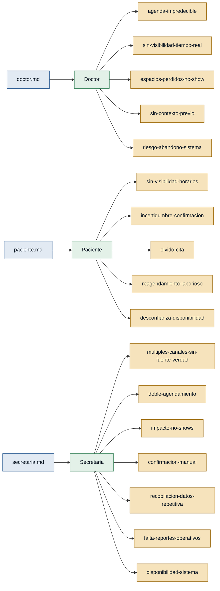

# Personas y Stakeholders — citasdentista

> Generado desde: `doctor.md`, `paciente.md`, `secretaria.md`
> Regla de trazabilidad: cada dolor cita su entrevista fuente.

---

## Personas

### Doctor — médico tratante
- **Contexto:** Profesional que atiende pacientes según agenda diaria en una consulta dental; no gestiona las citas directamente pero es el receptor directo de sus consecuencias.
- **Objetivo principal:** Llegar a cada turno con información completa y una agenda predecible que no se desordene por cambios de último momento.
- **Dolores:**
  - `agenda-impredecible` — La agenda cambia en el día: llegadas tarde, cancelaciones, sobrecupos y pacientes con hora equivocada (doctor.md).
  - `sin-visibilidad-tiempo-real` — No sabe en tiempo real quién confirmó, quién canceló ni cuánto tiempo requiere cada cita (doctor.md).
  - `espacios-perdidos-no-show` — Los no-shows vacían turnos sin posibilidad de rellenarlos; luego se acumula gente y trabaja bajo presión (doctor.md).
  - `sin-contexto-previo` — Atiende sin información suficiente: tipo de consulta (primera vez / control), motivo, estado de confirmación (doctor.md).
  - `riesgo-abandono-sistema` — Teme que si el sistema es complejo, recepción vuelva al cuaderno o al WhatsApp y el problema persista (doctor.md).
- **Respaldo:** `primera mano` (doctor.md)

---

### Paciente — usuario final del servicio
- **Contexto:** Persona que necesita atención dental y gestiona sus citas de forma asincrónica, generalmente desde el celular y en horario laboral.
- **Objetivo principal:** Reservar, confirmar y modificar una cita de forma autónoma, rápida y sin ambigüedad.
- **Dolores:**
  - `sin-visibilidad-horarios` — No puede ver horarios disponibles desde el inicio; debe preguntar uno a uno y esperar respuesta (paciente.md).
  - `incertidumbre-confirmacion` — No recibe comprobante ni recordatorio claro de que la cita quedó agendada (paciente.md).
  - `olvido-cita` — Agenda con anticipación y olvida por falta de recordatorio; no puede cancelar a tiempo (paciente.md).
  - `reagendamiento-laborioso` — Cambiar o cancelar requiere llamar o escribir y esperar; genera sensación de culpa por ocupar un espacio (paciente.md).
  - `desconfianza-disponibilidad` — Teme llegar y que la cita no aparezca en el sistema o que los horarios mostrados ya estén ocupados (paciente.md).
- **Respaldo:** `primera mano` (paciente.md)

---

### Secretaria — operadora de recepción
- **Contexto:** Personal de recepción que coordina la agenda entre el flujo entrante de pacientes (llamadas, WhatsApp, presencial) y los horarios del doctor.
- **Objetivo principal:** Gestionar la agenda del día sin errores, sin sobrecarga y con una única fuente de verdad.
- **Dolores:**
  - `multiples-canales-sin-fuente-verdad` — Las citas llegan por llamadas, WhatsApp y presencial sin consolidarse; los cambios se pierden entre canales (secretaria.md).
  - `doble-agendamiento` — Errores frecuentes: dos pacientes en el mismo turno, horarios mal anotados, cambios que no se actualizan (secretaria.md).
  - `impacto-no-shows` — Los no-shows vacían la agenda en hora pico; no hay tiempo de encontrar reemplazo ni justificarlo ante el doctor (secretaria.md).
  - `confirmacion-manual` — Confirmar pacientes uno a uno por mensaje o llamada consume tiempo que no hay en recepción (secretaria.md).
  - `recopilacion-datos-repetitiva` — Recoger nombre, doctor, motivo y tipo de consulta por WhatsApp es tedioso y se repite todo el día (secretaria.md).
  - `falta-reportes-operativos` — No hay reportes de citas del día, ausentismo ni estadísticas de horarios con mayor abandono (secretaria.md).
  - `disponibilidad-sistema` — Preocupación por caídas del sistema en hora pico; si falla, complica toda la operación (secretaria.md).
- **Respaldo:** `primera mano` (secretaria.md)

---

## Stakeholders

### Administración de la clínica
- **Interés en el sistema:** Eficiencia operativa (menos errores, menos tiempo administrativo) y maximización del uso de la agenda médica (reducir no-shows y huecos).
- **Fuente:** Mencionado de forma implícita en doctor.md ("la consulta") y secretaria.md ("la clínica", reportes operativos solicitados por gestión). No hay entrevista propia de este rol.

---

## Mapa de trazabilidad

> **Verde** = respaldo de primera mano · **Ámbar** = solo referenciada
